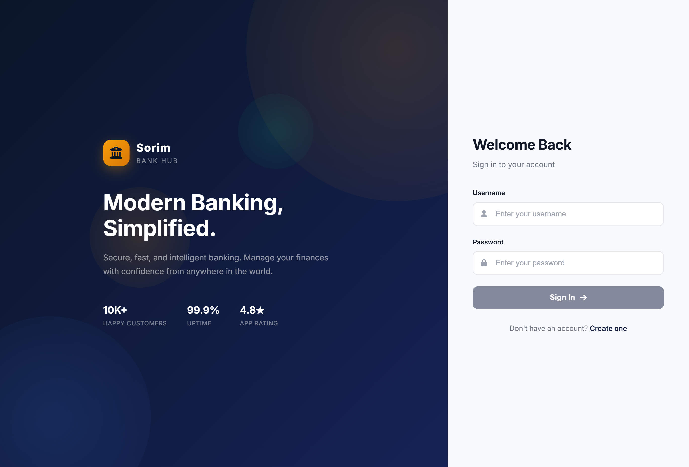
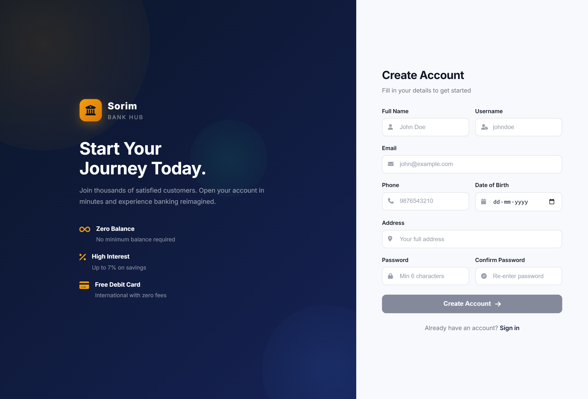
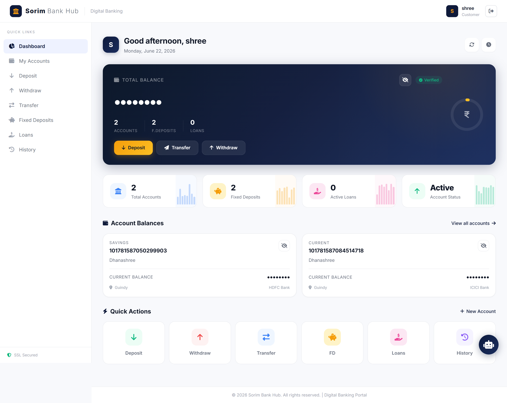
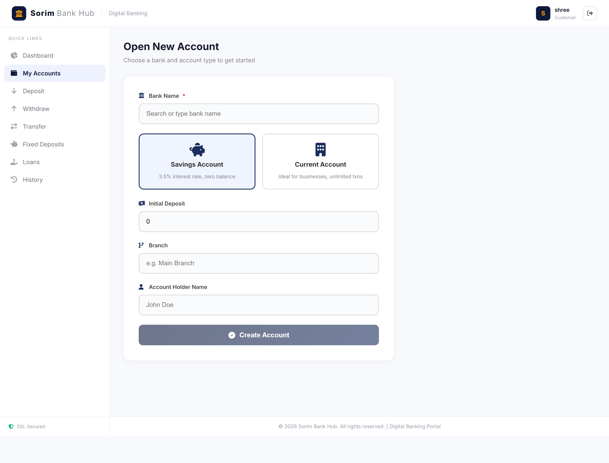
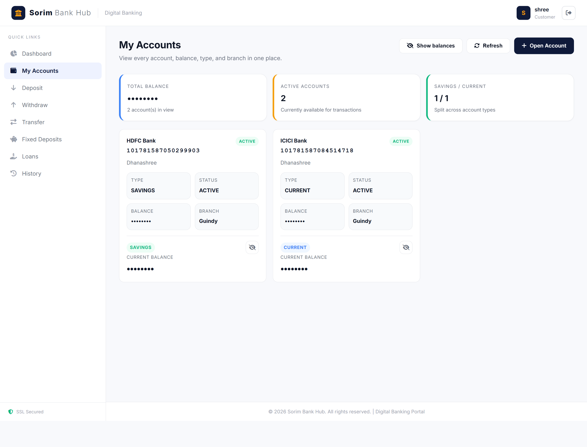
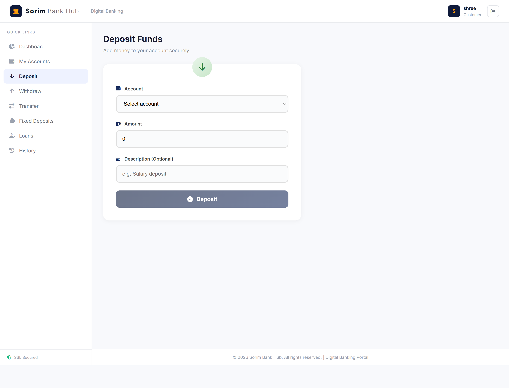
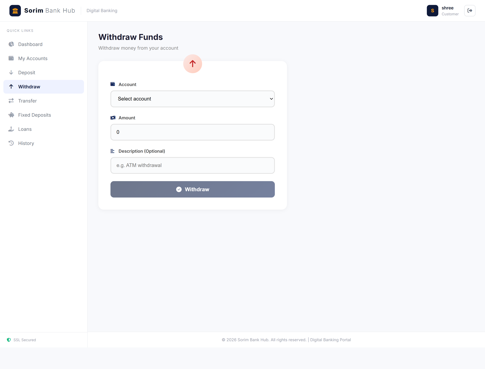
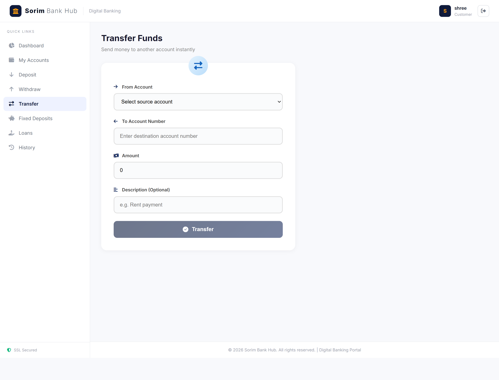
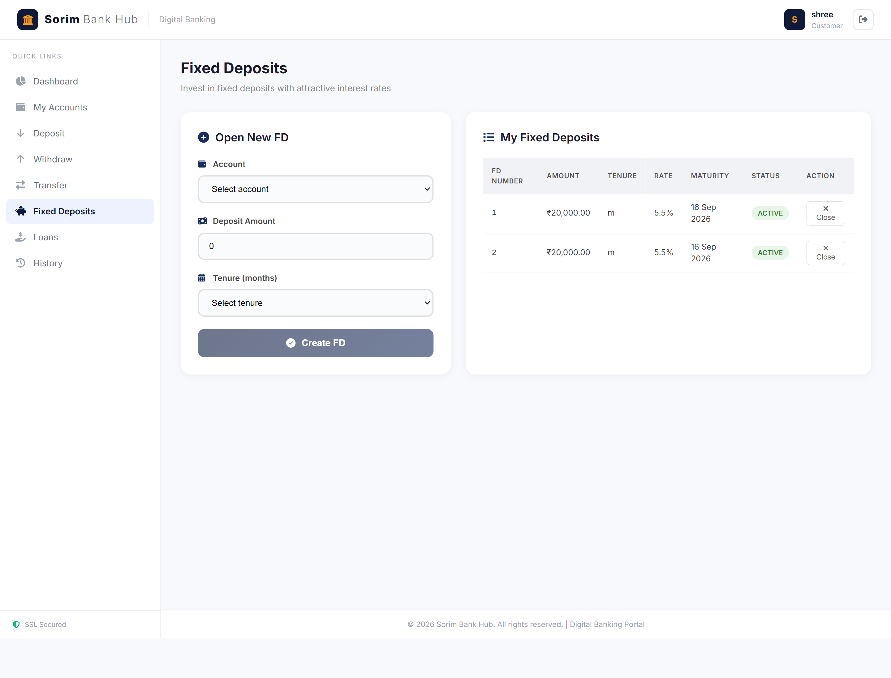
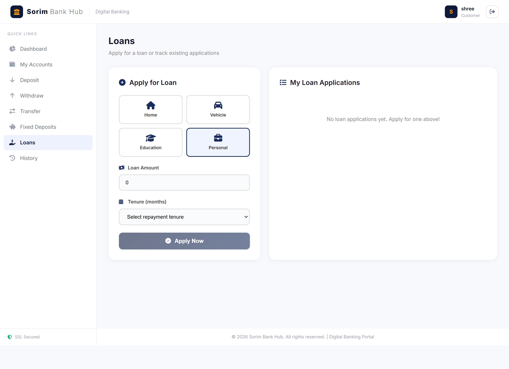

# 🏦 Banking Transaction Management System

<div align="center">


A secure enterprise-level Banking Transaction Management System developed using Spring Boot, Angular, MySQL, JWT Authentication, and Role-Based Access Control (RBAC).

</div>

---

# 📖 Overview

The Banking Transaction Management System is a full-stack web application designed to simulate real-world banking operations. It provides secure account management, transaction processing, fixed deposit handling, loan management, statement generation, and audit tracking.

The system follows modern software engineering practices using REST APIs, JWT Authentication, Spring Security, Angular Frontend, and MySQL Database.

---

# 🎯 Project Objectives

* Provide secure customer registration and authentication
* Enable account creation and management
* Support deposits, withdrawals, and fund transfers
* Manage fixed deposits and loans
* Generate account statements
* Maintain transaction history
* Implement audit logging for banking operations
* Follow industry-standard security practices

---

# 🏗️ System Architecture

```text
+-----------------------+
|   Angular Frontend    |
+-----------+-----------+
            |
            | REST API
            v
+-----------------------+
|   Spring Boot API     |
|-----------------------|
| Spring Security       |
| JWT Authentication    |
| Business Services     |
| JPA / Hibernate       |
+-----------+-----------+
            |
            v
+-----------------------+
|     MySQL Database    |
+-----------------------+
```

---

# 🚀 Features

## 👤 User Management

* Customer Registration
* Secure Login
* JWT Authentication
* Password Encryption using BCrypt
* Role-Based Access Control
* Profile Management

---

## 🏦 Account Management

* Create Savings Account
* Create Current Account
* View Account Details
* Check Balance
* Close Account
* Account Ownership Validation

---

## 💰 Transaction Management

### Deposit

* Deposit money into account
* Automatic balance updates

### Withdraw

* Balance validation
* Insufficient funds protection

### Fund Transfer

* Transfer between accounts
* Sender validation
* Receiver validation
* Transaction reference generation

### Transaction History

* Pagination support
* Sorting support
* Date range filtering

---

## 📈 Fixed Deposit Module

* Create Fixed Deposit
* Interest Calculation
* Maturity Amount Calculation
* View Active Deposits
* Close Matured Deposits

---

## 🏠 Loan Management

### Customer Features

* Apply for Loan
* Track Loan Status

### Admin Features

* Approve Loan
* Reject Loan
* Manage Loan Applications

### Loan Status

* Pending
* Approved
* Rejected

---

## 📄 Statement Generation

* Generate PDF Statements
* Download Account Reports
* Transaction Summary Reports

---

## 📋 Audit Logging

Tracks:

* Login Activities
* Deposits
* Withdrawals
* Transfers
* Account Creation
* Loan Approvals
* Balance Checks

---

# 🔐 Security Features

## JWT Authentication

```text
Login
  ↓
JWT Token Generated
  ↓
Stored on Client
  ↓
Sent with API Requests
  ↓
Backend Validation
```

## Password Security

* BCrypt Password Encoding
* Secure Hashing
* No Plain Text Password Storage

## Role-Based Access Control

### CUSTOMER

* Manage Accounts
* Deposit Funds
* Withdraw Funds
* Transfer Funds
* Apply Loans
* Create Fixed Deposits

### ADMIN

* Manage Loans
* View Audit Logs
* Monitor Transactions

---

# 🛠️ Technology Stack

## Backend

| Technology        | Purpose               |
| ----------------- | --------------------- |
| Java 17           | Programming Language  |
| Spring Boot 3.3.5 | Backend Framework     |
| Spring Security   | Authentication        |
| JWT               | Authorization         |
| Spring Data JPA   | ORM                   |
| Hibernate         | Database Access       |
| Maven             | Build Tool            |
| MySQL             | Database              |
| Swagger           | API Documentation     |
| Lombok            | Boilerplate Reduction |
| ModelMapper       | DTO Mapping           |
| OpenPDF           | PDF Generation        |
| Java Mail         | Email Services        |

---

## Frontend

| Technology       | Purpose              |
| ---------------- | -------------------- |
| Angular 22       | Frontend Framework   |
| TypeScript       | Programming Language |
| Angular Material | UI Components        |
| Bootstrap        | Responsive Design    |
| Chart.js         | Charts & Analytics   |
| RxJS             | Reactive Programming |

---

# 📂 Project Structure

```text
Final_Bank_Project
│
├── backend
│   ├── controller
│   ├── service
│   ├── repository
│   ├── entity
│   ├── dto
│   ├── security
│   ├── config
│   └── audit
│
├── banking-app
│   ├── src
│   │   ├── app
│   │   ├── pages
│   │   ├── shared
│   │   ├── models
│   │   └── services
│   │
│   └── environments
│
└── README.md
```

---

# ⚙️ Installation & Setup

## Prerequisites

Install:

* Java 17
* Maven 3.9+
* Node.js 20+
* Angular CLI
* MySQL 8+

Verify Installation

```bash
java -version
mvn -version
node -v
npm -v
```

---

# 🗄️ Database Setup

Create Database

```sql
CREATE DATABASE banking_db;
```

Update:

application.properties

```properties
spring.datasource.url=jdbc:mysql://localhost:3306/banking_db
spring.datasource.username=root
spring.datasource.password=your_password
```

---

# 🔧 Backend Configuration

Navigate:

```bash
cd backend
```

Install Dependencies

```bash
mvn clean install
```

Run Application

```bash
mvn spring-boot:run
```

Backend URL

```text
http://localhost:8080
```

---

# 🎨 Frontend Configuration

Navigate:

```bash
cd banking-app
```

Install Dependencies

```bash
npm install
```

Run Angular Application

```bash
ng serve
```

Frontend URL

```text
http://localhost:4200
```

---

# 📚 API Documentation

Swagger UI

```text
http://localhost:8080/swagger-ui.html
```

OpenAPI Specification

```text
http://localhost:8080/v3/api-docs
```

---

# 🔄 Application Workflow

## Customer Workflow

```text
Register
   ↓
Login
   ↓
JWT Token Generated
   ↓
Create Account
   ↓
Deposit Funds
   ↓
Transfer Funds
   ↓
View Transactions
   ↓
Generate Statement
```

---

## Loan Workflow

```text
Apply Loan
     ↓
Loan Request Created
     ↓
Admin Review
     ↓
Approve / Reject
     ↓
Status Updated
```

---

## Fixed Deposit Workflow

```text
Create FD
    ↓
Interest Calculation
    ↓
Maturity Amount Generated
    ↓
Track Deposit
```

---

# 🧪 Testing

Run Unit Tests

```bash
mvn test
```

---

# 📸 Screenshots

## Login Page



## Signup Page



## Dashboard



## Account Management





## Deposit Funds



## Withdraw Funds



## Transfer Funds



## Fixed Deposit Module



## Loan Management



---

# 🔮 Future Enhancements

* Internet Banking
* Mobile Banking App
* UPI Integration
* SMS Notifications
* Fraud Detection using AI
* Credit Score Verification
* Multi-Bank Integration
* Docker Deployment
* Kubernetes Deployment
* Microservices Architecture

---

# 👩‍💻 Author

### Meenalozhnee R

Developed as a full-stack banking application using Spring Boot, Angular, MySQL, JWT Authentication, and REST APIs.

---

